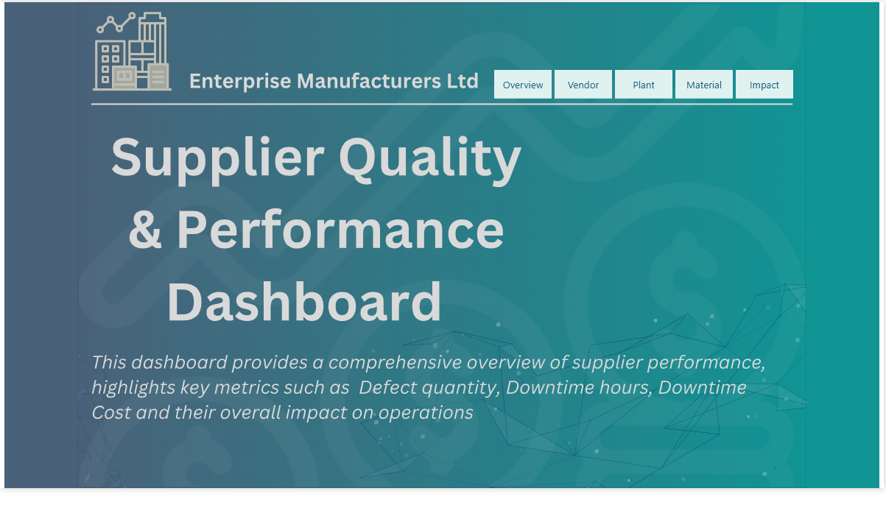

# Supplier Quality & Performance

---
## Introduction
This project focused on solving a major problem for Enterprise Manufacturing Company that didn’t have a proper system to manage its purchases. This led to differences in the quality of materials from suppliers and inefficiencies across different factory locations. 
Using data collected on materials, defects, suppliers, and downtime, the goal was to create clear and useful insights. These insights were presented through easy-to-understand visualizations in Power BI, helping the management team make better and more informed decisions.
##### _Disclaimer_ : _All datasets and reports do not represent any company, institution or country, but just a dummy dataset to demostrate capabilities of Power BI._

## Problem Statement
1.  Which vendors/plants are causing the greatest defect quantity?
2.	Which vendors/plants are causing the greatest downtime?
3.	Is there a particular combination of material and vendor that perform poorly?
4.	Is there a particular combination of Vendor and plant that performs poorly?
5.	How does the same vendor and material perform across different plants?

## Skills / Concept demonstrated:
- Bookmarking,
- DAX,
- Quick measures,
- Page navigation,
- Modeling,
- Filters,
- Tooltips,
- Buttons

## Data Source
The dataset used for this analysis was obtained during my search for comprehensive and rich data to refine my skills in data analysis. It contains detailed records from multiple plants and includes key information such as:

- Vendor Details: Names and associated metrics for suppliers.
- Plant Locations: Locations where materials were received and utilized.
- Categories and Types of Materials: Detailed classifications of raw materials and other components.
- Types and Impacts of Defects: Specific defect classifications, including their operational impacts.
- Total Defect Quantities: The number of defective units recorded for each combination of vendor, plant, and material.
- Downtime Minutes: Operational delays caused by defective materials.
  
This dataset spans two years of operations, offering a comprehensive view of supplier performance and enabling meaningful insights into the impact of defects on production efficiency.

## Data Cleaning & Modeling
The dataset required preprocessing to ensure accuracy and consistency.
###### Key steps included:
- Handled missing values: Ensured no critical data points were missing, addressing gaps in defect quantities or downtime minutes.
- Standardized Data Formats: Unified inconsistent date formats and standardized categorical values for vendors, plants, and material types.
- Filtered Relevant Data: Removed outliers and irrelevant entries (e.g. entries with zero defect quantities or downtime).

