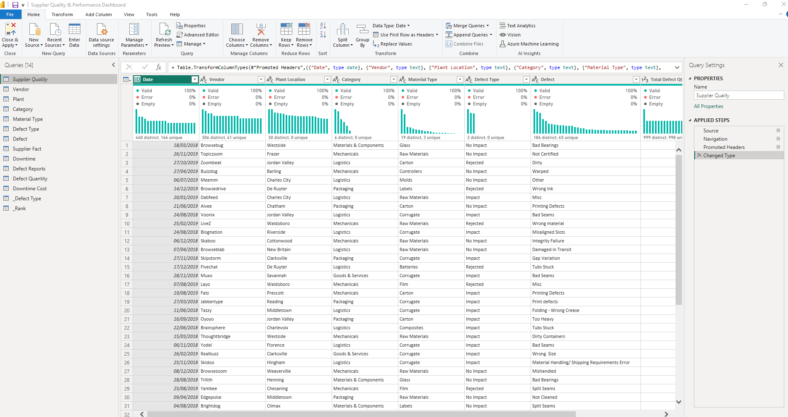
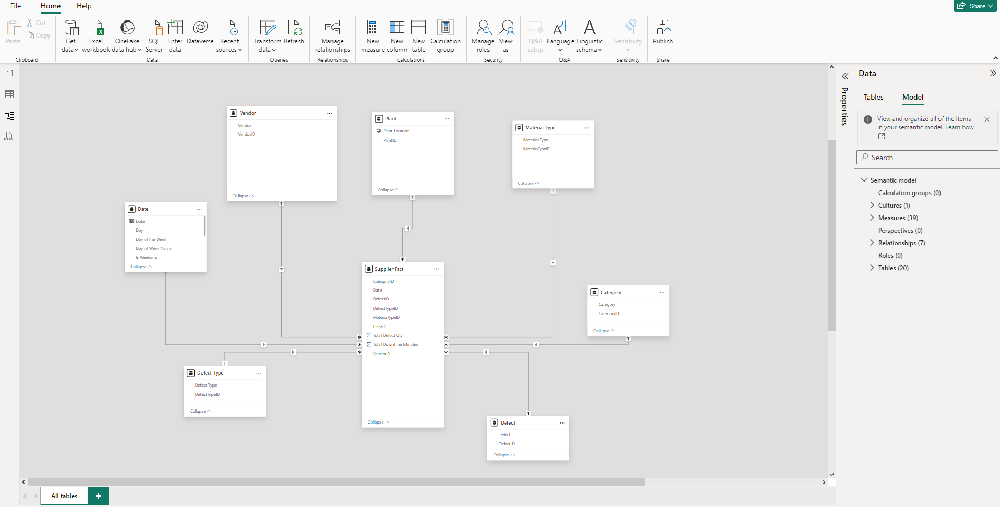
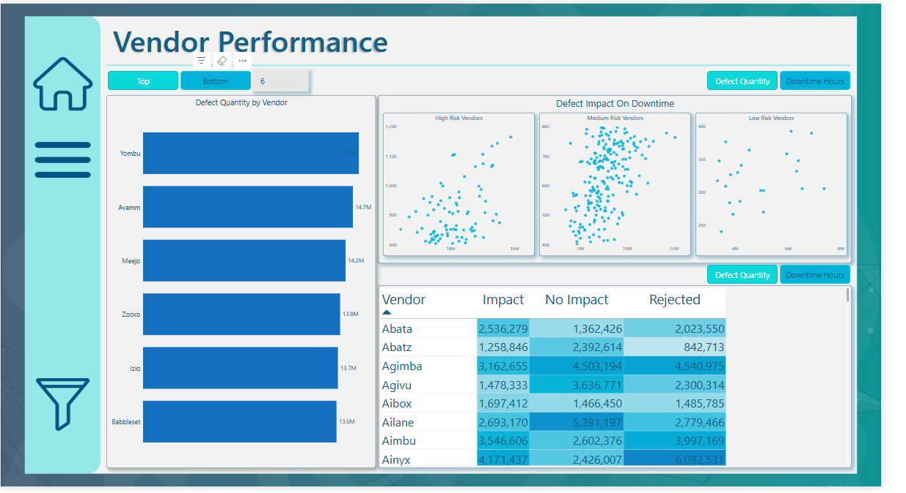
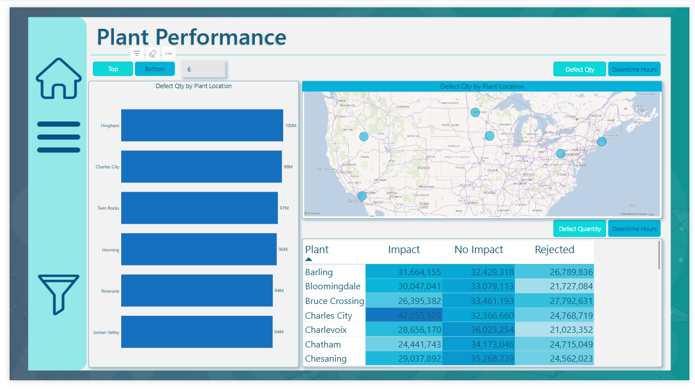
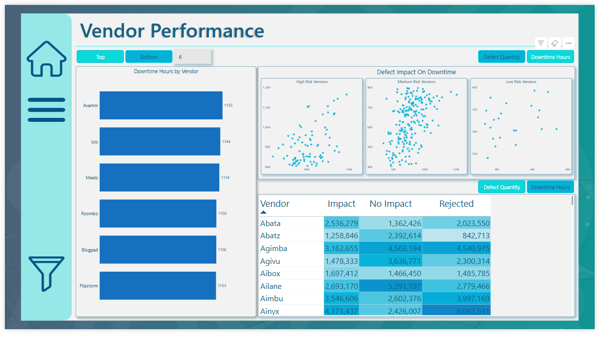
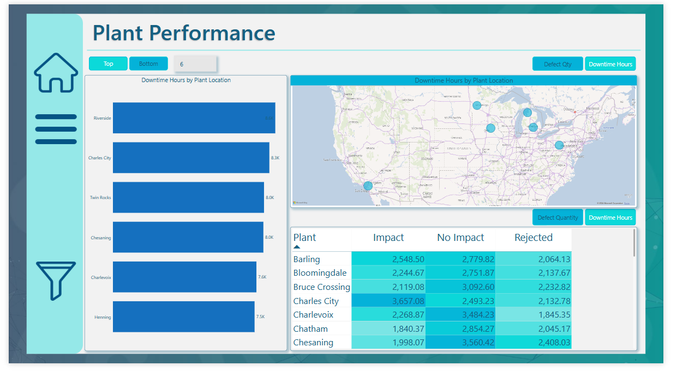
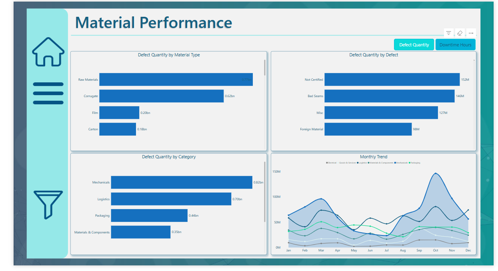

# Supplier Quality & Performance Analysis

---
## Introduction
This project focused on solving a major problem for Enterprise Manufacturing Company that didn’t have a proper system to manage its purchases. This led to differences in the quality of materials from suppliers and inefficiencies across different factory locations. 
Using data collected on materials, defects, suppliers, and downtime, the goal was to create clear and useful insights. These insights were presented through easy-to-understand visualizations in Power BI, helping the management team make better and more informed decisions.
##### _Disclaimer_ : _All datasets and reports do not represent any company, institution or country, but just a dummy dataset to demostrate capabilities of Power BI._

## Problem Statement
1.  Which vendors/plants are causing the greatest defect quantity?
2.	Which vendors/plants are causing the greatest downtime?
3.	Is there a particular combination of material and vendor that perform poorly?
4.	Is there a particular combination of Vendor and plant that performs poorly?
5.	How does the same vendor and material perform across different plants?

## Skills / Concept demonstrated:
- Bookmarking,
- DAX,
- Quick measures,
- Page navigation,
- Modeling,
- Filters,
- Tooltips,
- Buttons

## Data Source
The dataset used for this analysis was obtained during my search for comprehensive and rich data to refine my skills in data analysis. It contains detailed records from multiple plants and includes key information such as:

- Vendor Details: Names and associated metrics for suppliers.
- Plant Locations: Locations where materials were received and utilized.
- Categories and Types of Materials: Detailed classifications of raw materials and other components.
- Types and Impacts of Defects: Specific defect classifications, including their operational impacts.
- Total Defect Quantities: The number of defective units recorded for each combination of vendor, plant, and material.
- Downtime Minutes: Operational delays caused by defective materials.
  
This dataset spans two years of operations, offering a comprehensive view of supplier performance and enabling meaningful insights into the impact of defects on production efficiency.

## Data Normalization & Modeling
The dataset required preprocessing to ensure accuracy and consistency.
###### Key steps included:
- Handled missing values: Ensured no critical data points were missing, addressing gaps in defect quantities or downtime minutes.
- Standardized Data Formats: Unified inconsistent date formats and standardized categorical values for vendors, plants, and material types.
- Filtered Relevant Data: Removed outliers and irrelevant entries (e.g. entries with zero defect quantities or downtime).

###### Modeling:
I created primary keys for dimension tables, such as vendors, plants, and material types, to uniquely identify records and enable seamless integration with the fact table. 
This step ensured a robust data model, allowing accurate connections between dimensional and transactional data, ultimately enhancing the efficiency and reliability of the analysis.
These steps prepared the data for meaningful analysis, ensuring all insights were derived from high-quality, reliable data.

The model is a star schema. The dimension table are all joined to the fact table with one-to-many relationship.

Data Normalisation                  |            Data Modeling
:----------------------------------:|:---------------------------:
              |        

## Data Analysis
In this project, I used Power BI to perform an in-depth analysis of supplier performance and its impact on operational efficiency. Here's a breakdown of some steps I took and the measures I created using DAX to uncover valuable insights:
   - Date Table Creation
     - The first step was to create a Date Table to enable time-based analysis. This table provided a foundation for filtering data by months, years, and custom time frames, making it easier to track trends and 
     compare performance across periods.
     
           Date = ADDCOLUMNS(
                              CALENDARAUTO(),
                              "Year", YEAR([Date]),
                              "Quarter", QUARTER([Date]),
                              "Month", MONTH([Date]),
                              "Month Name", FORMAT([Date], "mmmm"),
                              "Month Name Short", FORMAT([Date], "mmm"),
                              "Day", DAY([Date]),
                              "Day of the Week", WEEKDAY([Date]),
                              "Day of Week Name", FORMAT([Date], "dddd"),
                              "Week of Year", WEEKNUM([Date]),
                              "Is Weekend", IF(WEEKDAY([Date]) IN {1, 7}, TRUE, FALSE)
            )

  - Measures
    - I developed base measures to calculate essential metrics such as total downtime, defect quantities, and costs. These measures allowed me to identify:
      -Vendors supplying materials causing the highest downtime.
     
          1. Total Downtime Hours = [Total Downtime Minutes]/60
      
          2. Total Downtime Minutes = SUM('Supplier Fact'[Total Downtime Minutes])
      
          3. Total Downtime Hours PM = CALCULATE([Total Downtime Hours],PARALLELPERIOD('Date'[Date], -1,MONTH))
      
          4. Total Downtime Hours SPLY = CALCULATE([Total Downtime Hours],SAMEPERIODLASTYEAR('Date'[Date]))
      
    - Vendors with the most defects.
              
           1. Total Downtime Cost PM = CALCULATE('Downtime Cost'[Downtime Cost/Hr], PARALLELPERIOD('Date'[Date],-1,MONTH))

           2. YOYGrowthDefectQuantity = 
                DIVIDE(
                    [Total Defect Qty] - [Defect Qty SPLY],
                    [Defect Qty SPLY]
                )

           3. MOM Defect Quantity Trend Icon = 
                    VAR PositiveIcon = UNICHAR(9650)
                      VAR NegativeIcon = UNICHAR(9650)
                        VAR Choice = IF([MOMGrowthDefectQuantity]> 0, PositiveIcon, NegativeIcon)
                          VAR Display = Choice & " " & FORMAT ([MOMGrowthDefectQuantity], "0.00%")
                            RETURN Display
        
     - Risk categories for vendors based on their performance (high, medium, low).
      
           1. Risk Category = 
                  VAR CurrentVendor = SELECTEDVALUE(Vendor[Vendor])
                    VAR TotalDowntimeHours = CALCULATE([Total Downtime Hours], FILTER(Vendor, Vendor[Vendor] = CurrentVendor))
                      RETURN IF([Total Downtime Hours] > 800, "High Risk" ,  IF([Total Downtime Hours] <= 800 && [Total Downtime Hours] >= 400, "Medium Risk", "Low Risk"))
              
   - Yearly Comparison
      - To track progress, I created measures to compare performance:

     - Last Year vs. This Year: Evaluated how defects and downtime changed over the years.

     - Total Defect Last Month: Focused on recent performance to identify emerging issues.
       
             TotaL Defect Qty PM = CALCULATE([Total Defect Qty],PARALLELPERIOD('Date'[Date],-1, MONTH))
       
     - Total Defect Previous Year: Helped establish baselines for improvement tracking.
       
             Defect Qty SPLY = CALCULATE([Total Defect Qty],SAMEPERIODLASTYEAR('Date'[Date]))
       
- Trends Analysis
  - I built measures to visualize trends over time:
     - Defect Trend: Displayed how defect quantities changed month-to-month.
      
            MOM Defect Quantity Trend Icon = 
                VAR PositiveIcon = UNICHAR(9650)
                  VAR NegativeIcon = UNICHAR(9650)
                    VAR Choice = IF([MOMGrowthDefectQuantity]> 0, PositiveIcon, NegativeIcon)
                      VAR Display = Choice & " " & FORMAT ([MOMGrowthDefectQuantity], "0.00%")
                        RETURN Display
    
     - Downtime Trend: Highlighted patterns in downtime hours, helping pinpoint seasonal or recurring issues.
      
              YOY Downtime Hour Trend Icon = 
                VAR PositiveIcon = UNICHAR(9650)
                  VAR NegativeIcon = UNICHAR(9650)
                    VAR Choice = IF([YOYGrowthDowntimeHours]> 0, PositiveIcon, NegativeIcon)
                      VAR Display = Choice & " " & FORMAT ([YOYGrowthDowntimeHours], "0.00%")
                        RETURN Display
      
## Visualisation:

The report comprises of 5 pages 
1. Overview
2. Vendor Performance
3. Plant Performance
4. Material Performance
5. Impact

You can interact with the report [here](https://app.powerbi.com/view?r=eyJrIjoiNWEyNjI0OGQtNzE4NC00YjRmLTlmNWYtMDdiYjUxMmQxM2NjIiwidCI6ImZmMGYzZTNhLTNlNTMtNDU0Zi1iMmI1LTZjNjg3NTNiOGVlNCJ9)

## Exploratory Analysis:
An initial exploration revealed critical trends answering the question;
#### 1. Which vendors/plants are causing the greatest defect quantity?

Vendor                              |                Plant
:----------------------------------:|:---------------------------:
              |        
                                  
- Vendors such as Yombu, Avamm, and Meejo contributed disproportionately to defects with Yombu leading list of suppliers with 15.1M defect quantites while Avamm and Meejo has 14.7M and 14.2M respectively.
- Locations like Hingham, Charles City, and Twin Rocks recorded the highest defect quantities (100M, 99M and 97M respectively)

#### 2. Which vendors/plants are causing the greatest downtime?

Vendor                              |                Plant
:----------------------------------:|:---------------------------:
              |        

Vendors causing the greatest downtime:
- Avamm (1,165 hours)
- Izio (1,144 hours)
- Meetz (1,134 hours)

Plants causing the greatest downtime:
- Riverside (8.6K hours)
- Charles City (8.3K hours)
- Twin Rocks (8.0K hours)
  
These vendors and plants represent the largest contributors to operational delays and should be prioritized for quality and process improvement initiatives.

#### 3. Is there a particular combination of material and vendor that perform poorly?

 

#### **Material-Vendor Combinations Performing Poorly**

1. Raw Materials:
   - Contributed to the highest downtime (66K hours) and defect quantity (0.77 billion), indicating consistent issues across multiple vendors.
   - Vendors such as **Edgeblab** and **Yombu** are likely key contributors, as they are linked to high downtime and defects in other areas.

2. Corrugates:
   - Downtime 51K hours and defect quantity 0.62 billion were also significant, often linked to vendors like **Zooveo**, which show consistent performance issues.

Key Combinations:
   - Raw Materials and Edgeblab are a problematic combination, causing high defect quantities and downtime.
   - Corrugate and Zooveo also stand out as a poorly performing combination, with significant operational impact.

This combination of materials and vendors points to systemic issues with specific supply chains, particularly for raw materials and corrugates. Addressing these problems with high-risk vendors will be critical to reducing defects and downtime.

#### 4.	Is there a particular combination of Vendor and plant that performs poorly?

Plant Defect                        |           Plant Downtime
:----------------------------------:|:---------------------------:
               |     

#### **Vendor and Plant Combinations Performing Poorly**
  1. Charles City and Vendors:
     - Charles City has one of the highest downtime hours (8.3K) and defect impacts. Vendors contributing to this should be closely examined (previously identified vendors like Yombu and Avamm).
  2. Riverside and Vendors:
     - Riverside recorded the highest downtime hours (8.6K). Vendor relationships here need immediate attention.
  3. Twin Rocks and Vendors:
     - Twin Rocks also has a significant impact, with 8.0K downtime hours and high defect quantities.
       
     Combinations:
     - Yombu at Charles City: A previously identified problematic vendor showing significant downtime and defect rates.
     - Avamm at Riverside and Twin Rocks: Contributes to high operational delays.
     
      These combinations represent critical areas requiring vendor specific performance reviews and potential process standardization across these plants.

#### 5. How does the same vendor and material perform across different plants?

 #### **Performance of the Same Vendor and Material Across Different Plants**
  1. Yombu with Raw Materials:
     - Prescott Plant: Yombu's raw materials contributed to the highest defects and downtime (over 3.2M defects and 11.7K minutes of downtime).
     - Westside Plant: Significant issues as well, with 2.5M defects and 12.3K minutes of downtime.
     - Chesaning Plant: Lower defect quantities (1.6M) and downtime (5K minutes), suggesting variability in material handling or quality control.
  2. Avamm with Corrugates:
     - Charles City Plant: High defect counts and notable downtime impact, indicating poor performance.
     - Riverside Plant: A similar pattern of high downtime and defects, showing consistent issues with Avamm's corrugates across locations.

## Results/Findings:
- Overall Downtime Increase
  - Downtime hours rose from 96.58K in 2018 to 119.23K in 2019, reflecting a 23.45% increase, highlighting growing operational challenges.
    
- Top Contributing Vendors
  - In 2018, Edgeblab and Izio were the highest contributors to downtime.
  - In 2019, Avamm, Meejo, and Livetube led to the most downtime, with Avamm topping the list.

- Worst-Performing Plants
  - Henning, Clarksville, and Hingham recorded the most downtime in 2018.
  - In 2019, Charles City, Twin Rocks, and Barling emerged as the most affected plants.

- Defect Categories Driving Downtime
  - In 2018, Bad Seams caused the most downtime, followed by Incomplete and Out of Spec defects.
  - By 2019, Not Certified defects became the leading issue, alongside Miscellaneous and Bad Parameters.

- Downtime Cost Increase
  - Downtime costs increased significantly, from $965.81K/hour in 2018 to $1.19M/hour in 2019, raising the financial burden.

- Defect Cost Trends
  - Defect costs rose notably from 2018 to 2019, driven by worsening quality issues across key vendors and materials, demand urgent attention.

These findings underline the need for targeted interventions in vendor management, quality assurance, and plant level operational processes to mitigate downtime and reduce associated costs.

## Recommendations

  1. Strengthen Vendor Management:
     - Implement stricter vendor performance reviews and quality assurance standards for high-risk vendors like Avamm, Meejo, and Edgeblab. Collaborate with these vendors to address recurring defects and downtime issues.

  2. Optimize Plant Operations:
       - Standardize operational processes across plants, focusing on high-impact locations like Charles City, Twin Rocks, and Hingham. Provide targeted training to ensure consistent handling of materials.

  3. Focus on Defect Prevention:
       - Address key defect categories such as Not Certified and Bad Seams by introducing material-specific quality checks and preventive measures for raw materials and corrugates.

## Conclusion
By focusing on vendor accountability, operational consistency, and defect prevention, the organization can significantly reduce downtime, control defect costs, and enhance overall efficiency.

